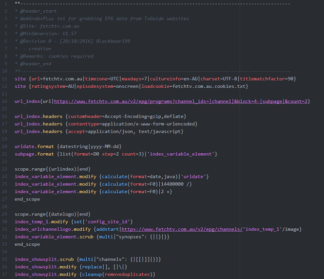

# [Webgrab+Plus](http://webgrabplus.com) package

A [Webgrab+Plus](http://webgrabplus.com) support package.

## Installation
    apm install webgrabplus-atom

## Functionality

| Command | Info | Default key binding |
|----------|--------|------------------
| `WG tidy-siteini` | Clean up the siteini file | `Cmd-Alt-T` |
| `build trigger` | Run WebGrab+Plus *1 | `F9` |
>- *1
    For Run to work, the WebGrab+Plus.exe path must be defined. This can be done by
    **Package > WebGrab+Plus > Select WebGrab+Plus.exe**
    On non-.NET platforms, you must also define the mono path. This can be done by
    **Package > WebGrab+Plus > Select mono**
